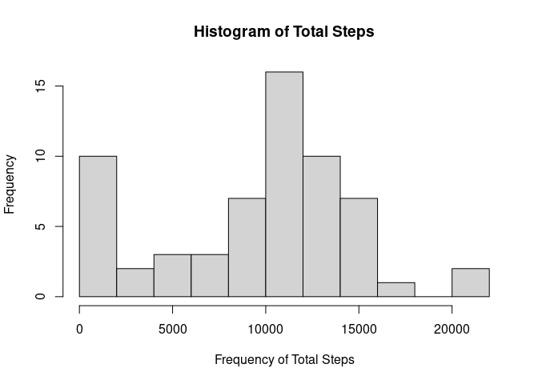
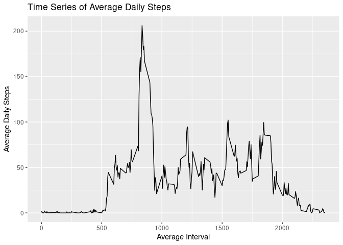
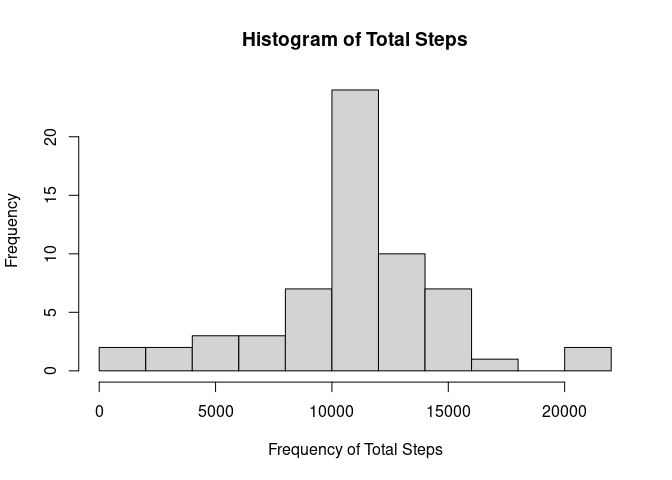
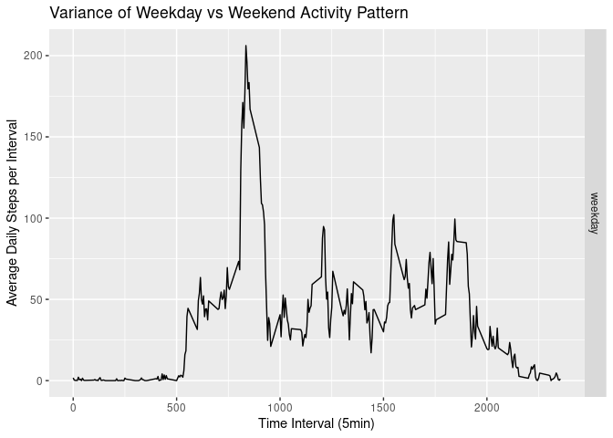

## Loading and preprocessing the data


```r
zipUrl <- 'https://d396qusza40orc.cloudfront.net/repdata%2Fdata%2Factivity.zip'
if(!file.exists('./data')){dir.create('./data')}
download.file(zipUrl, destfile = './data/dataset.zip', method = 'curl')
unzip(zipfile = './data/dataset.zip', exdir = './data/')

library(dplyr)
library(ggplot2)
library(xtable)

df <- read.csv('./data/activity.csv')
```

## What is mean total number of steps taken per day?


```r
totSteps <- df %>%
        group_by(date) %>%
        summarise(totSteps = sum(steps, na.rm = TRUE))

hist(totSteps$totSteps,
     xlab = 'Frequency of Total Steps',
     breaks = 10,
     main = 'Histogram of Total Steps')
```

<!-- -->

```r
meanDailySteps <- round(mean(totSteps$totSteps, na.rm = TRUE))
print(meanDailySteps)
```

```
## [1] 9354
```

```r
# Calculating the median of daily total steps
medianDailySteps <- median(totSteps$totSteps, na.rm = TRUE)
print(medianDailySteps)
```

```
## [1] 10395
```


## What is the average daily activity pattern?


```r
avgDaily <- df %>%
        group_by(interval) %>%
        summarise(avgInterval = mean(steps, na.rm = TRUE))

p1 <- ggplot(data=avgDaily, aes(x=avgDaily$interval, y=avgDaily$avgInterval, group=1)) +
        geom_line() + 
        labs(title = 'Time Series of Average Daily Steps',
             x = 'Average Interval',
             y = 'Average Daily Steps')

print(p1)
```

<!-- -->


```r
### Which 5-minute interval, on average across all the days in the dataset, contains the maximum number of steps?

peak <- avgDaily$interval[which.max(avgDaily$avgInterval)]
print(peak) 
```

```
## [1] 835
```


## Imputing missing values

```r
naCount <- sum(is.na(df$steps))
print(naCount)
```

```
## [1] 2304
```

```r
dfImputed <- df

dfImputed$steps[which(is.na(dfImputed$steps))] <- avgDaily$avgInterval

totStepsImp <- dfImputed %>%
        group_by(date) %>%
        summarise(totSteps = sum(steps, na.rm = TRUE))

hist(totStepsImp$totSteps,
     xlab = 'Frequency of Total Steps',
     breaks = 10,
     main = 'Histogram of Total Steps')
```

<!-- -->


### Do these values differ from the estimates from the first part of the assignment? 

Yes, there is a large amount of missing data, however the shape is similar.

## What is the impact of imputing missing data on the estimates of the total daily number of steps?

```r
meanDailyStepsImp <- round(mean(totStepsImp$totSteps, na.rm = TRUE))
medianDailyStepsImp <- median(totStepsImp$totSteps, na.rm = TRUE)

imputationResults <- data.frame(
        Means = c(meanDailySteps, meanDailyStepsImp),
        Medians = c(medianDailySteps, medianDailyStepsImp)
)

row.names(imputationResults) <- c('Original', 'Imputed')

print(xtable(imputationResults), type="html")
```

<!-- html table generated in R 4.0.3 by xtable 1.8-4 package -->
<!-- Wed Feb 10 08:39:07 2021 -->
<table border=1>
<tr> <th>  </th> <th> Means </th> <th> Medians </th>  </tr>
  <tr> <td align="right"> Original </td> <td align="right"> 9354.00 </td> <td align="right"> 10395.00 </td> </tr>
  <tr> <td align="right"> Imputed </td> <td align="right"> 10766.00 </td> <td align="right"> 10766.19 </td> </tr>
   </table>

## Are there differences in activity patterns between weekdays and weekends?


```r
weekdays(as.Date(df$date[1]))
```

```
## [1] "Monday"
```

```r
dfImp2 <- dfImputed

dfImp2$partOfWeek <- 'weekday'
dfImp2$partOfWeek[dfImp2$day == 'Saturday' | dfImp2$day == 'Sunday'] <- 'weekend'


partOfWeekResults <- dfImp2  %>%
        group_by(partOfWeek, interval) %>%
        summarise(avgInterval = mean(steps, na.rm = TRUE))
```

```
## `summarise()` has grouped output by 'partOfWeek'. You can override using the `.groups` argument.
```

```r
p2 <- ggplot(partOfWeekResults, aes(x = interval, y = avgInterval, group = 1)) + 
        geom_line() +
        facet_grid(rows = vars(partOfWeek)) + 
        xlab('Time Interval (5min)') +
        ylab('Average Daily Steps per Interval')+
        ggtitle('Variance of Weekday vs Weekend Activity Pattern')

print(p2)
```

<!-- -->

